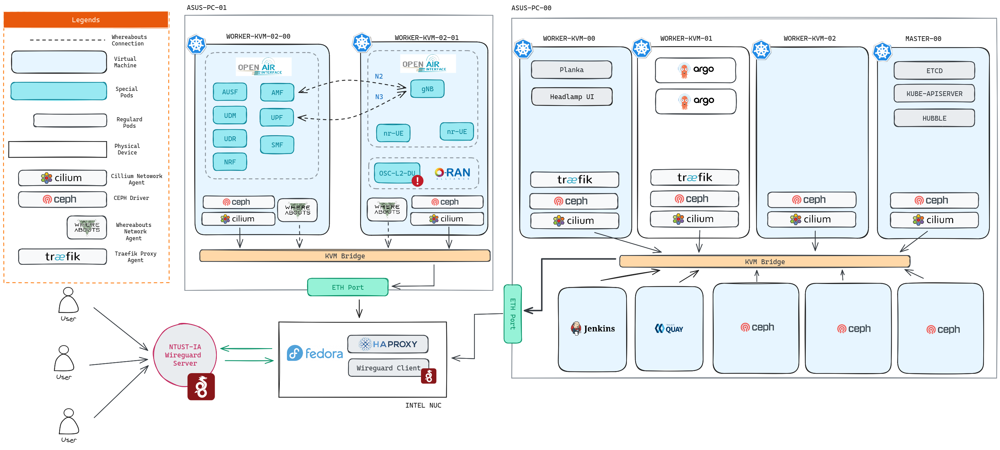

# 📑 CI/CD

## 1. Deployment

  

### 1.1 Jenkins

This jenkins is deployed on BMW Lab's server at IA

| Context | Value |
|:---:|:---:|
| **CPU** | 8 vCPU |
| **Storage** | 150GB |
| **Memory** | 8GB |
| **OS** | RHEL 9.3 (Plow) |
| **OAM** | 192.168.8.72 |

#### 1.1.1 Installation


1. Jenkins LTS

   ```bash
   sudo wget -O /etc/yum.repos.d/jenkins.repo \
       https://pkg.jenkins.io/redhat-stable/jenkins.repo
   sudo rpm --import https://pkg.jenkins.io/redhat-stable/jenkins.io-2023.key
   sudo dnf upgrade
   # Add required dependencies for the jenkins package
   sudo dnf install fontconfig java-17-openjdk
   sudo dnf install jenkins
   sudo systemctl daemon-reload
   ```
2. Enable Jenkins' service on boot

   ```bash
   sudo systemctl enable jenkins
   ```
3. Start Jenkin's service

   ```bash
   sudo systemctl start jenkins
   ```
4. Allow Jenkins 8080 port on firewall

   
:::warning
   *This part will be overwritten using ssl setup on nginx proxy in near future*

   :::

   ```bash=
   YOURPORT=8080
   PERM="--permanent"
   SERV="$PERM --service=jenkins"
   
   firewall-cmd $PERM --new-service=jenkins
   firewall-cmd $SERV --set-short="Jenkins ports"
   firewall-cmd $SERV --set-description="Jenkins port exceptions"
   firewall-cmd $SERV --add-port=$YOURPORT/tcp
   firewall-cmd $PERM --add-service=jenkins
   firewall-cmd --zone=public --add-service=http --permanent
   firewall-cmd --reload
   ```
5. Initialize Jenkins' token

   

   Get the token using:

   ```bash=
   cat /var/lib/jenkins/secrets/initialAdminPassword
   ```
6. Access the jenkins from your browser through `http://<JENKINS-VM-IP>:8080`

   
:::warning
   *~~This part will be overwritten using ssl setup on nginx proxy in near future~~*
   * SSL Already implemented
   * \

   :::

   \
7. Choose the plugins you want to use.

   

   


### 1.2 Kubernetes Cluster \[EE 705-7\]


 

 

#### 1.2.1 Hypervisor Setup

| Name | CPU | Memory | Storage | Static IP | Context |
|:---:|:---:|:---:|:---:|----|:---|
| quay | 2 | 2GB | 50GB | 10.20.1.101 | Image Registry, Virtual Machine |
| master-00 | 2 | 2GB | 50GB | 10.20.1.110 | Master, Virtual Machine |
| worker-00 | 1 | 4GB | 50GB | 10.20.1.111 | Worker, Virtual Machine |
| worker-01 | 1 | 4GB | 50GB | 10.20.1.112 | Worker, Virtual Machine |
| ceph-mon-00 | 1 | 4GB | 20GB,100GB | 10.20.1.103 | Ceph Monitoring Node, Virtual Machine |
| ceph-osd-00 | 1 | 4GB | 20GB,100GB | 10.20.1.104 | Ceph OSD Node, Virtual Machine |
| ceph-osd-01 | 1 | 4GB | 20GB,100GB | 10.20.1.105 | Ceph OSD Node, Virtual Machine |


  

#### 1.2.2 Automated K8S Setup With Ansible

##### 1.2.2.1 Setup DHCP Server


:::warning
\:warning: Using shared internet from nmcli is not reliable, as the kvm interface bridged to intel nuc will lose its ip on random ocassion.

:::

Config `/etc/dhcpd/dhcpd.conf` for static IP assignment for each node.

```conf=
default-lease-time 3600;
max-lease-time 86400;
authoritative;
subnet 10.20.1.0 netmask 255.255.255.0 {
	range 10.20.1.100 10.20.1.200;
	option routers 10.20.1.1;
	option subnet-mask 255.255.255.0;
	option domain-name-servers 10.20.1.1;
}

host k8s-kvm {
 hardware ethernet b0:6e:bf:3a:5a:7f;
 fixed-address 10.20.1.100;
}

host k8s-quay {
 hardware ethernet 52:54:00:0a:2f:96;
 fixed-address 10.20.1.101;
}

host k8s-m-0 {
 # Master Nodes
 hardware ethernet 52:54:00:13:21:70;
 fixed-address 10.20.1.110;
}

host k8s-w-0 {
 # Worker
 hardware ethernet 52:54:00:85:6a:60;
 fixed-address 10.20.1.111;
}

host k8s-w-1 {
 # Worker
 hardware ethernet 52:54:00:4d:7a:a3;
 fixed-address 10.20.1.112;
}

host k8s-w-2 {
 # Worker
 hardware ethernet 52:54:00:5f:f4:67;
 fixed-address 10.20.1.113;
}
```

###### 1.2.2.2 Setup DNS Server


1. Install bind dns server

   ```bash=
   sudo dnf install -y bind bind-utils
   ```
2. Assign the listen port on the interface's IP that connected to the k8s cluster


```conf=
...
	listen-on port 53 { 127.0.0.1; 10.20.1.1; };
	listen-on-v6 port 53 { ::1; };
	directory 	"/var/named";
	dump-file 	"/var/named/data/cache_dump.db";
	statistics-file "/var/named/data/named_stats.txt";
	memstatistics-file "/var/named/data/named_mem_stats.txt";
	secroots-file	"/var/named/data/named.secroots";
	recursing-file	"/var/named/data/named.recursing";
	allow-query     { localhost; 10.20.1.0/24; };

	forwarders {
		8.8.8.8;
		8.8.4.4;
	};
...
```

| Correct DNS Response from client side (Master Node) |
|:---:|
|   |

##### 1.2.2.3 Ansible Playbook for automated deployment

I put my ansible codes [here](https://git.nnag.me/infidel/). If you want to learn more about the installation cycle read the `playbooks/setup.yaml` file.

Assign the target nodes IP on `packet-hostst.ini` file.

```ansible=
[master_bootstrap]
# Master 00

10.20.1.110 ansible_python_interpreter=python3 ansible_user=root node_ip=10.20.1.110 master=master-00 kubeproxyfree=true hubble=true new_hostname=master-00
    
[nodes]
# Workers

10.20.1.111 ansible_python_interpreter=python3 ansible_user=root new_hostname=worker-00 worker=true

10.20.1.112 ansible_python_interpreter=python3 ansible_user=root new_hostname=worker-01 worker=true

10.20.1.113 ansible_python_interpreter=python3 ansible_user=root new_hostname=worker-02 worker=true
```

Start the deployment by invoking

```bash=
ansible-playbook -i packet-hosts.ini playbooks/setup.yaml
```

Ansible is used for Auto deployment of this POC kuberentes cluster.

| Ansible Setup |
|:---:|
|   |

#### 1.2.3 Cluster Management


1. Headlamp

### 1.3 ArgoCD


1. Install ArgoCD on k8s cluster.

```bash=
kubectl create namespace argocd

kubectl apply -n argocd -f https://raw.githubusercontent.com/argoproj/argo-cd/stable/manifests/install.yaml
```

 


2. Allow port-forward on ArgoCD UI
3. Access ArgoCD

   
:::info
   \:information_source: retrive initial account password

   :::

   

### 1.4 Quay: Image Registry

[Quay](https://www.projectquay.io/) is a container image registry that enables you to build, organize, distribute, and deploy containers. Quay gives you security over your repositories with image vulnerability scanning and robust access controls. Project Quay provides a scalable open source platform to host container images across any size organization.

#### 1.4.1 Quay Installation


1. Installation using Podman Compose

 


2\. Initial Quay Configuration

 


3. Access Quay Service

 

#### 1.4.2 Quay Testing

Push image from Intel NUC to Quay Registry

 

Image  hosted on Quay Registry

 

### 1.5 Traefik: Load Balancer

Setup proper ingress rules to allow users access the services inside our cluster.


#### Installation


1. Use helm to install ...
2. Create SSL certificate for the SSL connection.

I create mine with CN of `*.bmw.local`.

 

This way I can reuse the same certificate over and over again as long my domain name is ended with `.bmw.local`.

 


3. Overwrite deployment declaration to utilize 80 and 443 port
4. Create `traefik.containo.us/v1alpha1` declaration for each services.

   > Check your services !

   ```yaml=
   apiVersion: traefik.containo.us/v1alpha1
   kind: IngressRoute
   metadata:
     name: argocd-ingress
     namespace: kube-system
   spec:
     entryPoints:
     - websecure
     routes:
     - kind: Rule
       match: Host(`argocd.bmw.local`) && PathPrefix(`/`)
       services:
       - name: argocd-ui
         port: 80
     tls:
       secretName: bmw.local
   ```

### 1.6 Ceph: Software Defined Storage

  

 

## 2.Integration


### 2.1 Core Network (OAI CN)


1. SCTP now works

 


2\. Core Running

 


3. Testing with gNB

 


:::warning
\:warning: There still issue with the gnb being terminated prematurely. Will work on this later.

:::


#### Jenkins Test


1. Fetch github access token for jenkins.
2. Fetch Quay access token for jenkins
3. Jenkins Build

   ```log=
   export REGISTRY=quay.bmw.local
   export QUAY_USER=infidel
   export QUAY_REPO=osc-dul2
   
   podman build -t poc-00-o_du_l2 .
   #podman login --tls-verify=false quay.bmw.local -u 
   podman login --tls-verify=false -u="infidel+bmw_jenkins_00" -p="4W7AYC8O9NMIVZYRD4Y77986PANLRPQROPU4H8CHU1CIR3JABIP9NPX4OOM7GNF3" quay.bmw.local
   podman tag poc-00-o_du_l2 $REGISTRY/$QUAY_USER/$QUAY_REPO
   podman push --tls-verify=false $REGISTRY/$QUAY_USER/$QUAY_REPO
   ```

   > 
:::spoiler ***Jenkins Build Logs...***
   > ```console
   > Started by user Yosafat Marselino Agus
   > Running as SYSTEM
   > Building in workspace /var/lib/jenkins/workspace/FP-00-O_DU_L2
   > The recommended git tool is: NONE
   > No credentials specified
   >  > git rev-parse --resolve-git-dir /var/lib/jenkins/workspace/FP-00-O_DU_L2/.git # timeout=10
   > Fetching changes from the remote Git repository
   >  > git config remote.origin.url https://github.com/motangpuar/o-du-l2 # timeout=10
   > Fetching upstream changes from https://github.com/motangpuar/o-du-l2
   >  > git --version # timeout=10
   >  > git --version # 'git version 2.39.3'
   >  > git fetch --tags --force --progress -- https://github.com/motangpuar/o-du-l2 +refs/heads/*:refs/remotes/origin/* # timeout=10
   >  > git rev-parse refs/remotes/origin/master^{commit} # timeout=10
   > Checking out Revision 9a3349c61e03973a24fdfd66b4630e8385cacbf3 (refs/remotes/origin/master)
   >  > git config core.sparsecheckout # timeout=10
   >  > git checkout -f 9a3349c61e03973a24fdfd66b4630e8385cacbf3 # timeout=10
   > Commit message: "Test commit"
   >  > git rev-list --no-walk 9a3349c61e03973a24fdfd66b4630e8385cacbf3 # timeout=10
   > [FP-00-O_DU_L2] $ /bin/sh -xe /tmp/jenkins12064359481664895621.sh
   > + export REGISTRY=quay.bmw.local
   > + REGISTRY=quay.bmw.local
   > + export QUAY_USER=infidel
   > + QUAY_USER=infidel
   > + export QUAY_REPO=osc-dul2
   > + QUAY_REPO=osc-dul2
   > + podman build -t poc-00-o_du_l2 .
   > STEP 1/13: FROM nexus3.o-ran-sc.org:10002/o-ran-sc/bldr-ubuntu18-c-go:1.9.0
   > STEP 2/13: ADD . /opt/o-du-l2
   > --> Using cache 156f0e4c2ae803fa5cd49bd80efb619a0021344dc6266d356ca30c9fb6d409e7
   > --> 156f0e4c2ae8
   > STEP 3/13: WORKDIR /opt/o-du-l2
   > --> Using cache 2dbf94dbfa6d6cb86151d7f15bd0a6c802cb92d06188471b79bd170c76a5193d
   > --> 2dbf94dbfa6d
   > STEP 4/13: RUN apt-get update && apt-get install -y libpcap-dev && apt-get install -y libxml2-dev
   > --> Using cache bb65a76a8eb28b8527425c67ee2c6f1c997e4e1dfa83c691eb2c450af7de8f9d
   > --> bb65a76a8eb2
   > STEP 5/13: RUN cd build/odu && make clean_odu odu MACHINE=BIT64 MODE=FDD
   > --> Using cache 0e95385659bba1d99bd6baf3dc719f11942961b4bf135f363014a4ce3518c432
   > --> 0e95385659bb
   > STEP 6/13: RUN cd build/odu && make clean_odu odu MACHINE=BIT64 MODE=TDD
   > --> Using cache 9956da1ea5675d2325e58ee2061d8dd80a7cd4dba2d27f7b8319845283d3193f
   > --> 9956da1ea567
   > STEP 7/13: RUN cd build/scripts && /bin/bash add_netconf_user.sh
   > --> Using cache 7e2a5990e9c79483d644c3165bd0cbd0e32db70bece8105bc4bdcd2607f4dd1f
   > --> 7e2a5990e9c7
   > STEP 8/13: RUN cd build/scripts && /bin/bash install_lib_O1.sh -c
   > --> Using cache 99df19b77f3baabd8e6c1714a87fcd1e98506e10e340a301ebe6237dc45f0c3a
   > --> 99df19b77f3b
   > STEP 9/13: RUN cd build/scripts && /bin/bash load_yang.sh
   > --> Using cache 9518b6875d614fa3c2a9bbaaaf45b155a2fb992cc93a4344ee22125187677109
   > --> 9518b6875d61
   > STEP 10/13: RUN cd build/odu && make clean_odu odu MACHINE=BIT64 MODE=FDD O1_ENABLE=YES
   > --> Using cache 5971ad48cc1669c9ba05021611b02610ac15b1033b3b10cf33be76f3e1ed68d2
   > --> 5971ad48cc16
   > STEP 11/13: RUN echo "Hello"
   > --> Using cache 4afacb5eedea05d799f30de5c3374b3ee25ad0eb0a1a4abbfcf0754b37b8a62f
   > --> 4afacb5eedea
   > STEP 12/13: RUN echo "Hello"
   > --> Using cache 9858caa69745377b9f69e6734b2b487468b9bf5f9e69dcb890da327dff8b5cfc
   > --> 9858caa69745
   > STEP 13/13: RUN echo "Hello"
   > --> Using cache 958fe801e636f1f04d7e0dbd8a15d70c10208f930a498b89f7cc56910eda6211
   > COMMIT poc-00-o_du_l2
   > --> 958fe801e636
   > Successfully tagged localhost/poc-00-o_du_l2:latest
   > Successfully tagged quay.bmw.local/infidel/osc-dul2:latest
   > 958fe801e636f1f04d7e0dbd8a15d70c10208f930a498b89f7cc56910eda6211
   > + podman login --tls-verify=false -u=infidel+bmw_jenkins_00 -p=4W7AYC8O9NMIVZYRD4Y77986PANLRPQROPU4H8CHU1CIR3JABIP9NPX4OOM7GNF3 quay.bmw.local
   > Login Succeeded!
   > + podman tag poc-00-o_du_l2 quay.bmw.local/infidel/osc-dul2
   > + podman push --tls-verify=false quay.bmw.local/infidel/osc-dul2
   > Getting image source signatures
   > Copying blob sha256:9dfdc6c2cdae061ffc2d14a843674e288f91adc76863ec1b0ff59c122085f20c
   > Copying blob sha256:23135df75b44a66efa9d8dc1a10051768c27bd95388f436eb9553e0eb17211f6
   > Copying blob sha256:b43408d5f11b7b2faf048ae4eb25c296536c571fb2f937b4f1c3883386e93d64
   > Copying blob sha256:e2cf47ababd5547eb85b17847cb46db66001e2b59e234e1f3c596bbf70f2368a
   > Copying blob sha256:fe6d8881187d429af3f636c574911690455825998c9f366e985eab646665e711
   > Copying blob sha256:b6ac51ac7a0681fdcf2ada852eb786e30340ec75f920150c1d903bbaa3e65b5e
   > Copying blob sha256:6dae3dd4be3b674d33ef41a2402a80bdc18d4a20a36a5f30f73a3aa43bf6f0f0
   > Copying blob sha256:1bf503e0c0258e57133d75dfa5f23a787839df3d5e941ab47bc9efd38870fc46
   > Copying blob sha256:17c362cf614d85bd0c5183d9087cde2b53faa91c1991dfa399249a8859fb84e1
   > Copying blob sha256:db5648ca16025fa5fd6b201f6650955c07275d58539bc6291a98613fb1c5115a
   > Copying blob sha256:6345f75ef121aa1e2d90185ee039fca84b5d57caa13e286547f8afc4935e6d9f
   > Copying blob sha256:cb678f9e67e1af221f4049e138abcb7b92b97bc8808a3b7546dc82d3916bc216
   > Copying blob sha256:03d718aad9c45f30b680c64b5e0c06414573be882762a07b7fa82801397baa32
   > Copying blob sha256:aecb423e94488000954a23e34da6ede1346a9846dcf063f46249c1399709e816
   > Copying blob sha256:cf94b62567bd0866d29c75ccd96a5d4fcf028a194c917b9d1139c350703c92dd
   > Copying blob sha256:2a07e9267a0ece252e16a41a5939fd8366f3d162a244deed332aff5e609fd6e0
   > Copying blob sha256:bad288d23d60cb92d37f40dee7a2e0220ce68e49c01dca8a020655bb8c603fc5
   > Copying blob sha256:9ed86edf49b5055f9142fa50bcc81f6f47bf8886ffa053c06b13d4a273cc7010
   > Copying blob sha256:e514fb0b2c0b5f0e229f87cea492adaffb6341f4302b21eead0fc36e86a7f459
   > Copying blob sha256:6623933e94a586a58885dfed2dc28a05260f397b9f480d95c12b0650dc69cd8e
   > Copying blob sha256:87a445d1414f65fb047926729f0e9b731b0f29e2949d1cfa3bc8ad1a828b2dc8
   > Copying blob sha256:07ff7e4339416dcb17d1fb1e9928d28e82210ef4666c97effde7dccd127a246a
   > Copying blob sha256:b2e82e1d281156e9cf000eb6b4fb1c1148baf057be0a9b1702d6a263510af7b5
   > Copying blob sha256:4fdb421c1f51cf357813cde4ffccfda8a416a034a33382a9ffd7ea3d558b1d8e
   > Copying config sha256:958fe801e636f1f04d7e0dbd8a15d70c10208f930a498b89f7cc56910eda6211
   > Writing manifest to image destination
   > Finished: SUCCESS
   > ```
   >
   > :::

### 2.2 Case 1: OSC-DU-L2 Build


1. Create jenkins account for @wilfrid

 


2. Wilfrid fetch @akmal OSC-DU-L2 version code into the Jenkins (*I forked it into my repo first to avoid conflict on the main repo*)
3. @wilfrid register on [quay](https://quay.bmw.lab) image registry

 


4. @wilfrid create build sequence and register the necessary credentials and url inside.

 


5. Trial and error the first build

 


6. Success build process produce docker image version of akmal's OSC-DU-L2 binary.

 


7. The produced docker image is pushed into the quay registry

 

### 2.3 Case 2: OAI 7.2 Build

#### Source Code

##### PHY


1. Checkout ...
2. Patch use OAI ...
3. Modify code on ...
4. Create `dockerfile`

##### OAI-DU


1. Checkout
2. Patch use OAI
3. Create `dockerfile`

#### Build Base Image (PHY)

 

 


#### Build Final Image (OAI-DU 7.2)

### 2.4 CD: Auto Deployment

## 3. Issues

### 3.1 Cilium: node-to-node communication failed

> **Solved**

#### 3.1.1 Symptmops


1. The pods failed to communicate with pod on another node.
2. Cilium health check failed on DNS test.

#### 3.1.2 Solution


1. Make sure the POD CIDR is covered by the cluster-pool ip used by cilium agents
2. Enable port respective to your deployment, as for mine VXLAN and Geneve needs 8472 and 51820 enabled.

### 3.2 Cilium: SCTP issue

 


1. Open5GS amf, smf, and hss crashed.

 


2. Any sctp depenent traffic dependent failed.

#### 3.1.2 Possible Solution


1. Use multus instead of cillium for SCTP dependent VNFs.

## Miscs

If you are interested to test the ci/cd platforms you can reach it via our internal Wireguard VPN.


1. Add `192.168.8.72` into your wireguard **DNS** section.

   
   1. Access the following faciliates and accept the self-signed ssl notificatoin on your browser.

| Services | Context | Remarks |
|----|----|----|
| <https://hubble.bmw.lab> | K8S Observer | CD Tool, contact for account |
| <https://argocd.bmw.lab> | CI/CD | CD Tool, contact for account |
| <https://quay.bmw.lab> | CI/CD | Image Registry, self-register |
| <https://hubble.bmw.lab> | K8S Observer | CD Tool, contact for account |
| <https://focalboard.bmw.lab> | Operational | Jira Alternative, check table below for demo account |
| <https://planka.bmw.lab> | Operational | Trello Alternative, check table below for demo account. |
| https://outline.bmw.lab | Operational | Internal Wiki for colaborative works. |
2. Demo Credentials

| Services | Username | Password |
|----|----|----|
| Focalboard | demo | password |
| Planka | demouser | bmwlab123 |


### Planka


:::info
*Free open source kanban board for workgroups.*

:::

**Features**


1. Import from trello
2. Markdown Support
3. Direct image Attachment

 

 

 

 

**Missing Features**


1. Mention other user
2. Hyperlink on tasks

### Focalboard

> Open source project management for technical teams

 